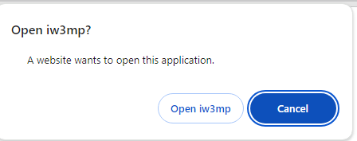

# How to Join a server outside of a game

You need to have COD4 installed on your PC for this to work.

## Join the Server via Web Browser

Go to your web browser, find the top bar where it says `http://<domain>`.
Remove all text and type `cod4://<ip-address>`, e.g:

```bash
cod4://116.203.137.128:28950
```
And the browser will pop this dialogue:



If you choose the *Open Iw3mp* option, the game will multiplayer game will start and connect to the specific server.

### Connect using DNS

```bash
/connect my-website.com:28951
```
*Note: You don't add www or http prefix when using website name.*


### Connect & Add Favorite

```bash
/connect <server-ip>; addFavorite <server-ip>
```

## Join the Server via CMD / Bat Script

Go to the location where you've installed COD4, typically its either:

* C:\Program Files\Call of Duty 4 Modern Warfare  (Regular)
* C:\Program Files\Steam\steamapps\common\Call of Duty 4  (Steam)

### Using CMD

* Open up a Command Prompt in this directory ([Learn How](https://mirzaleka.medium.com/getting-started-with-windows-command-prompt-5e326f894dd0#de0d))
* Type `start iw3mp`, then by `+` follwed by a command you wish to execute:

```bash
start iw3mp.exe +connect 116.203.137.128:28950
```

* Hit Enter

After this your should see a game running on your server.

#### Additionally you can toggle full screen when starting a game:

* Run in full screen mode: `start iw3mp.exe +set r_fullscreen 1 +connect 116.203.137.128:28950`
* Run in a window mode: `start iw3mp.exe +set r_fullscreen 0 +connect 116.203.137.128:28950`

### Using Bat script

I haven't officially tested this yet. Here is a full [guide](https://gaming.stackexchange.com/a/312008).

```bash
@ECHO OFF

ECHO 1 - Run Cod4

 CHOICE /C:1

IF errorlevel 1 goto Run Cod4

:Run Cod4
start iw3mp.exe +set r_fullscreen 0 +connect 5.230.135.107:28963
ECHO.
PAUSE
CLS
EXIT
```

**Credits** to users: Crafter0800 and RipplerXeon on StackExchange
